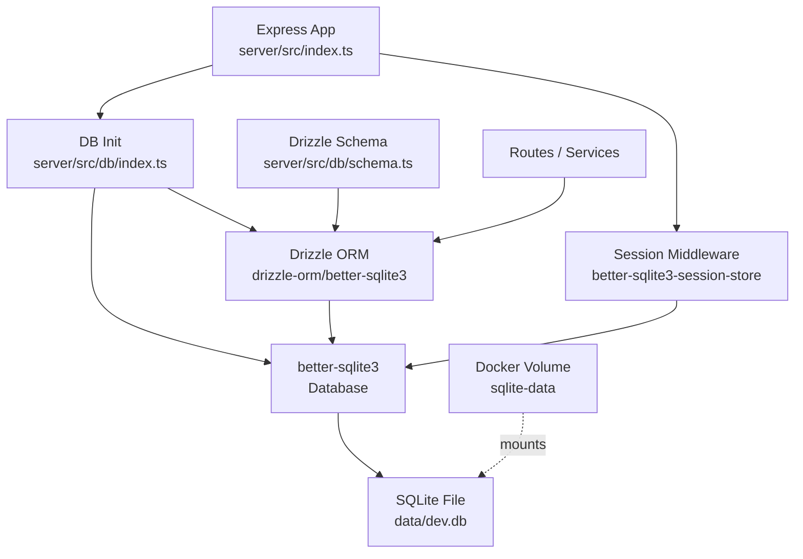
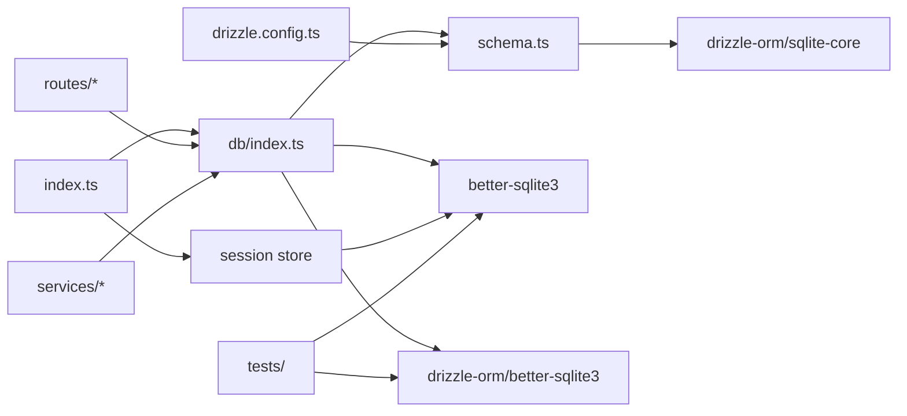

# Architecture Update — Sprint 001: Replace PostgreSQL with SQLite

## Sprint Changes Summary

| Area | Before | After |
|---|---|---|
| Database engine | PostgreSQL 16 (Docker container) | SQLite (embedded file) |
| Drizzle dialect | `postgresql` / `pg-core` | `sqlite` / `sqlite-core` |
| DB driver | `pg` (node-postgres) + `Pool` | `better-sqlite3` + `Database` |
| Session store | `connect-pg-simple` (Postgres-backed) | `better-sqlite3-session-store` |
| Docker services | `db` + `server` + `client` | `server` + `client` |
| DB connection wait | `wait-for-db.sh` (TCP probe) | Removed (file-based, always ready) |
| Secrets | `DB_PASSWORD` / `db_password` Swarm secret | None (no DB secret needed) |
| Migration history | 9 Postgres SQL migration files | Single fresh SQLite init migration |
| UUID generation | `defaultRandom()` (Postgres native) | `crypto.randomUUID()` (JS default) |
| Enum type | `pgEnum` | `text()` + TypeScript union type |
| Timestamp with TZ | `timestamp({ withTimezone: true })` | `integer({ mode: 'timestamp' })` |
| JSON column | `json()` (pg-core) | `text({ mode: 'json' })` |

---

## What Changed

### Module: Database Schema (`server/src/db/schema.ts`)

**Purpose:** Declare all application tables, their columns, and
constraints as Drizzle schema objects.

**Boundary:** Owns only schema definitions. No query logic, no
connection management.

**Use cases served:** SUC-001, SUC-002, SUC-003, SUC-004, SUC-006

All `pgTable` declarations are replaced with `sqliteTable`. The
following type mappings apply:

| Postgres type | SQLite equivalent |
|---|---|
| `serial('id').primaryKey()` | `integer('id', { mode: 'number' }).primaryKey({ autoIncrement: true })` |
| `text(...)` | `text(...)` (unchanged) |
| `integer(...)` | `integer(...)` (unchanged) |
| `real(...)` | `real(...)` (unchanged) |
| `boolean(...)` | `integer('...', { mode: 'boolean' })` |
| `timestamp(...)` | `integer('...', { mode: 'timestamp' })` |
| `json(...)` | `text('...', { mode: 'json' })` |
| `uuid(...)` | `text('...')` with `$defaultFn(() => crypto.randomUUID())` |
| `pgEnum(...)` + enum column | `text(...)` column with TypeScript union |

The `reviewStatusEnum` pg enum and its column usage are replaced with a
plain `text('status')` column. TypeScript callers continue to use the
union type `'pending' | 'draft' | 'sent'` — the constraint is enforced
at the application layer, not the DB layer.

The `sessions` table is kept in schema form for reference but ownership
of session table DDL moves to the session store library.

### Module: DB Initialization (`server/src/db/index.ts`)

**Purpose:** Create and export the single application-wide Drizzle DB
client.

**Boundary:** Owns connection creation only. All consumers receive a
typed `db` handle and are unaware of the underlying driver.

**Use cases served:** SUC-001, SUC-004, SUC-006

```
import Database from 'better-sqlite3';
import { drizzle } from 'drizzle-orm/better-sqlite3';
import * as schema from './schema';

const sqlite = new Database(process.env.DATABASE_URL!.replace('file:', ''));
export const db = drizzle(sqlite, { schema });
```

The `pg.Pool` is gone. No async connection setup is required — SQLite
opens synchronously.

### Module: Session Store (`server/src/index.ts` session middleware)

**Purpose:** Persist Express sessions across restarts.

**Boundary:** Session store is a plug-in to Express-session; it has no
direct application logic dependency.

**Use cases served:** SUC-001, SUC-004, SUC-005

`connect-pg-simple` and the `pg.Pool` instantiated solely for sessions
are removed. Replacement: `better-sqlite3-session-store` using the same
`better-sqlite3` instance already created for the application DB, or a
separate dedicated SQLite file. For tests, `process.env.NODE_ENV ===
'test'` already causes MemoryStore to be used — no change needed there.

### Module: Drizzle Config (`server/drizzle.config.ts`)

**Purpose:** Configure drizzle-kit for migration generation and
management.

**Boundary:** Build/dev tooling only; not imported by runtime code.

**Use cases served:** SUC-001, SUC-002

```typescript
export default defineConfig({
  schema: './src/db/schema.ts',
  out: './drizzle',
  dialect: 'sqlite',
  dbCredentials: {
    url: process.env.DATABASE_URL!,
  },
});
```

### Module: Migration History (`server/drizzle/`)

**Purpose:** Provide the ordered DDL that brings a fresh database to the
current schema version.

**Boundary:** SQL files consumed by drizzle-kit; not imported by
application code.

**Use cases served:** SUC-001, SUC-004

All 9 existing Postgres migration files and their meta snapshots are
deleted. A single new `0000_init.sql` is generated by running
`drizzle-kit generate` against the rewritten SQLite schema. The
`_journal.json` is reset accordingly.

### Module: Docker Composition (`docker-compose.yml`, `docker-compose.prod.yml`)

**Purpose:** Define the set of services that make up the application in
each environment.

**Boundary:** Infrastructure declaration only; not a code module.

**Use cases served:** SUC-004, SUC-005

The `db` Postgres service is removed from both files. The `server`
service gains a named volume mount:

```yaml
volumes:
  - sqlite-data:/app/data

volumes:
  sqlite-data:
```

The `DATABASE_URL` environment variable (set from `config/*/public.env`)
already uses `file:./data/dev.db` format — this value is now mapped to
the container path accordingly.

### Module: Startup Scripts (`docker/dev-server-start.sh`, `docker/wait-for-db.sh`)

**Purpose:** Container startup orchestration — wait for DB readiness,
run migrations, start the dev server.

**Boundary:** Shell scripts; not imported by application code.

**Use cases served:** SUC-004

`wait-for-db.sh` is deleted. Its only purpose was to probe `tcp:db:5432`
— irrelevant for a file database.

`dev-server-start.sh` removes the `npx wait-on tcp:db:5432` line and
the Prisma fallback; the migration command becomes `npx drizzle-kit migrate`.

### Module: Secrets Configuration

**Purpose:** Manage sensitive credentials required at runtime.

**Boundary:** `secrets/` files + `config/sops.yaml`.

**Use cases served:** SUC-005

`DB_PASSWORD` is removed from `secrets/dev.env.example`,
`secrets/prod.env.example`, and the live `secrets/dev.env` and
`secrets/prod.env` (re-encrypted after edit). `config/sops.yaml`
creation rules continue to cover remaining secrets unchanged.

### Module: Developer Environment Config (`.devcontainer/devcontainer.json`)

**Purpose:** Configure a reproducible VS Code / Codespaces devcontainer.

**Boundary:** IDE tooling only.

**Use cases served:** SUC-001

`DATABASE_URL` changes to `file:./data/dev.db`. `DB_PASSWORD`,
`DB_PORT`, and the port-5432 forward are removed. The
`Prisma.prisma` VS Code extension is removed (Prisma is not used).

### Module: Test Fixtures (`tests/db/`, `tests/server/`)

**Purpose:** Exercise the application against a real database to verify
schema constraints and route behavior.

**Boundary:** Test code; not imported by production code.

**Use cases served:** SUC-002, SUC-003

Both test directories replace the `pg.Pool` + `drizzle-orm/node-postgres`
pattern with a `better-sqlite3` in-memory database:

```typescript
import Database from 'better-sqlite3';
import { drizzle } from 'drizzle-orm/better-sqlite3';
const sqlite = new Database(':memory:');
// apply schema DDL then run tests
```

The `beforeAll` setup migrates the schema into the in-memory instance.
Cleanup via `db.delete(...)` calls remains structurally identical.

---

## Module Diagram



---

## Dependency Graph



No circular dependencies. All application code depends inward on `db/index.ts`;
tests depend directly on `better-sqlite3` for fixture setup.

---

## Why

PostgreSQL is appropriate when an application needs horizontal read replicas,
streaming replication, advanced full-text search, or inter-process pub/sub.
This application has none of those requirements. It is a single-node web app
deployed on Docker Swarm with one server replica. SQLite eliminates:

- The `db` Docker service and its resource overhead
- The `db_password` secret and its rotation/distribution surface area
- The async TCP connection pool and its failure modes
- The `wait-for-db.sh` startup sequencing dance
- The `connect-pg-simple` Postgres session dependency

SQLite's embedded nature means the DB is available the instant the server
process starts, with no network round-trips for queries.

---

## Impact on Existing Components

| Component | Impact |
|---|---|
| All route handlers | No change — they call Drizzle query methods unchanged |
| `server/src/services/pike13Sync.ts` | Remove `drizzle-orm/node-postgres` import; use shared `db` from `db/index.ts` |
| `server/src/index.ts` | Remove `pg.Pool`, `connect-pg-simple`; add `better-sqlite3-session-store` |
| `server/drizzle.config.ts` | Rewrite (dialect, driver) |
| `server/src/db/schema.ts` | Full rewrite of column types |
| `server/src/db/index.ts` | Full rewrite (driver swap) |
| `tests/db/*.test.ts` | Full rewrite of DB fixture setup |
| `tests/server/*.test.ts` | Import swap + fixture update |
| `docker-compose.yml` | Remove `db` service; add volume |
| `docker/dev-server-start.sh` | Remove TCP wait; update migration command |
| `docker/wait-for-db.sh` | Delete |
| `.devcontainer/devcontainer.json` | Update env vars; remove port forward |
| `secrets/` files | Remove `DB_PASSWORD` entries |
| `AGENTS.md`, `CLAUDE.md`, `docs/` | Remove Postgres philosophy; add SQLite guidance |

---

## Migration Concerns

**No production data migration is required** — the project is in
early-template state with no live data to carry forward.

**Schema migration reset:** The 9 existing Postgres migration files
cannot be applied to SQLite. They are deleted in their entirety and
replaced with a single `0000_init.sql` generated from the new SQLite
schema. This is a clean break, not an incremental migration.

**Deployment sequencing:** Any existing Postgres container in a dev or
staging environment can be stopped after the sprint. A `docker volume
prune` or targeted volume removal may be needed to clean up the old
`db` volume. New `sqlite-data` volume will be created on first deploy.

**Session invalidation:** Switching from the Postgres session store to
the SQLite-based store will invalidate all existing sessions at the
time of deployment. Users will need to log in again.

---

## Design Rationale

### Decision: better-sqlite3 over sql.js or @libsql/client

- **Context:** Drizzle supports multiple SQLite drivers.
- **Alternatives considered:** `sql.js` (WebAssembly, no native deps),
  `@libsql/client` (Turso-oriented, includes remote sync).
- **Why this choice:** `better-sqlite3` is synchronous, has no WASM
  overhead, is the most widely used Node.js SQLite driver, and is the
  driver Drizzle's SQLite quickstart recommends for server-side use.
  `sql.js` has worse performance for server workloads; `@libsql/client`
  adds unnecessary remote-sync infrastructure.
- **Consequences:** Native binary compilation required on the build
  host (standard with node-gyp; already handled by Docker multi-stage
  build). No async driver API — all DB calls are synchronous, which
  matches Express's synchronous handler model well.

### Decision: Delete Postgres migrations rather than convert them

- **Context:** 9 SQL files using Postgres DDL syntax (e.g., `CREATE
  TYPE`, `timestamp with time zone`, `uuid_generate_v4()`).
- **Alternatives considered:** Manual conversion of each file.
- **Why this choice:** The files contain Postgres-specific DDL that is
  not valid SQLite syntax. Manual conversion is error-prone and
  produces no value since the project has no live data to migrate. A
  single generated init migration is cleaner and authoritative.
- **Consequences:** Migration history from before this sprint is lost.
  This is acceptable given the early-template project state.

### Decision: SQLite enum simulation via text column + TypeScript union

- **Context:** SQLite has no native enum type; Postgres `pgEnum` must
  be replaced.
- **Alternatives considered:** `CHECK` constraint on the text column.
- **Why this choice:** TypeScript union types enforce valid values at
  compile time with no runtime overhead. A `CHECK` constraint would add
  DB-layer enforcement but would require raw SQL in the migration and
  is not natively expressible in Drizzle's SQLite column API.
- **Consequences:** Invalid enum values are caught by the TypeScript
  compiler, not the DB. For a single-language codebase this is
  sufficient.

---

## Open Questions

1. **Session store library:** `better-sqlite3-session-store` is the
   most straightforward choice but is a smaller community package.
   Should we evaluate `connect-better-sqlite3` or simply use
   MemoryStore in dev and a separate session file in prod? Stakeholder
   input welcome if there is a preference.

2. **Timestamps with timezone:** Drizzle's `integer({ mode: 'timestamp' })`
   stores milliseconds-since-epoch as an integer. Existing code that
   calls `.toISOString()` on timestamp values will continue to work
   since JS `Date` objects are returned. However, direct SQL inspection
   of the database will show integers, not human-readable timestamps.
   This is the accepted SQLite convention — confirm this is acceptable.

3. **`rundbat.yaml` `container_template` / `database_template`:** These
   fields appear to be Postgres-specific naming conventions. Should they
   be removed, or does rundbat use them for non-Postgres purposes?
   Verify before modifying.
