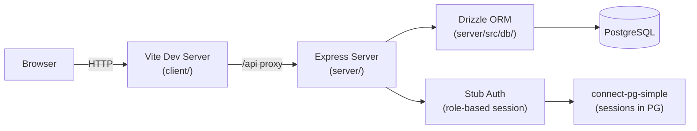

# Sprint 001 Technical Plan

## Architecture Version

- **From version**: none (greenfield on template)
- **To version**: architecture-001

## Architecture Overview



No `shared/` directory. The server owns all schema and business types; the
client defines lightweight response-shape interfaces locally.

## Component Design

### Component: Database Schema (`server/src/db/`)

**Use Cases**: SUC-001, SUC-002, SUC-003

**Files:**
- `server/src/db/index.ts` — Drizzle client (postgres connection pool)
- `server/src/db/schema.ts` — All table definitions + exported TS types
- `server/drizzle.config.ts` — drizzle-kit config pointing at `DATABASE_URL`
- `server/drizzle/` — Generated migration SQL files (committed)

**Tables:**

| Table | Key Columns |
|-------|-------------|
| `users` | `id` (serial PK), `email` (unique), `name`, `googleId`, `passwordHash`, `createdAt` |
| `sessions` | `sid` (text PK), `sess` (json), `expire` (timestamp) — managed by connect-pg-simple |
| `instructors` | `id`, `userId` (FK → users), `isActive` (bool, default false), `createdAt` |
| `students` | `id`, `name`, `guardianEmail`, `guardianName`, `createdAt` |
| `instructor_students` | `instructorId` (FK), `studentId` (FK), `assignedAt` — composite PK |
| `monthly_reviews` | `id`, `instructorId`, `studentId`, `month` (text YYYY-MM), `status` (enum: pending/draft/sent), `subject`, `body`, `sentAt`, `createdAt`, `updatedAt` |
| `review_templates` | `id`, `instructorId`, `name`, `subject`, `body`, `createdAt`, `updatedAt` |
| `service_feedback` | `id`, `reviewId` (FK), `rating` (int 1–5), `comment`, `submittedAt` |
| `admin_settings` | `id`, `email` (unique), `createdAt` |
| `pike13_tokens` | `id`, `instructorId` (FK, unique), `accessToken`, `refreshToken`, `expiresAt`, `createdAt`, `updatedAt` |

**Enums:** `review_status` = `pending | draft | sent`; `user_role` not a DB
enum — role is derived at runtime from `admin_settings` and
`instructors.isActive`.

**Prisma removal:**
- Delete `server/prisma/` directory
- Remove `@prisma/client` from `server/package.json`
- Add `drizzle-orm`, `drizzle-kit`, `pg`, `@types/pg`

---

### Component: Stub Auth (`server/src/routes/auth.ts`)

**Use Cases**: SUC-001, SUC-002, SUC-003

No Passport.js. No real users looked up. The stub synthesises fake user
objects from the requested role string and stores them in the session.

**Fake user shapes:**

```ts
// role: "admin"
{ id: 0, name: "Test Admin", email: "admin@test.local", isAdmin: true, isActiveInstructor: false }

// role: "instructor"
{ id: 1, name: "Test Instructor", email: "instructor@test.local", isAdmin: false, isActiveInstructor: true, instructorId: 1 }

// role: "inactive"
{ id: 2, name: "Pending User", email: "pending@test.local", isAdmin: false, isActiveInstructor: false }
```

**Routes:**

| Method | Path | Description |
|--------|------|-------------|
| POST | `/api/auth/login` | Body: `{ role }`. Sets `req.session.user`. Returns user object. |
| POST | `/api/auth/logout` | Destroys session. Returns 200. |
| GET | `/api/auth/me` | Returns `req.session.user` or 401 if no session. |

**Session config:**
- Store: `connect-pg-simple` (uses `sessions` table)
- Secret: `SESSION_SECRET` env var
- Cookie: `httpOnly: true`, `sameSite: 'lax'`, `maxAge: 7 days`

---

### Component: Role Middleware (`server/src/middleware/`)

**Use Cases**: SUC-003

```ts
isAuthenticated(req, res, next)  // 401 if no req.session.user
isAdmin(req, res, next)          // 403 if !session.user.isAdmin
isActiveInstructor(req, res, next) // 403 if !session.user.isActiveInstructor
```

---

### Component: Frontend Shell (`client/`)

**Use Cases**: SUC-001, SUC-002, SUC-003

**New dependencies:**
- `wouter` — routing
- `@tanstack/react-query` — server state
- `react-hook-form` + `@hookform/resolvers/zod` — forms
- `zod` — validation
- `shadcn/ui` (CLI init) + `tailwindcss` + `@tailwindcss/vite`

**Client-side types** (defined in `client/src/types/`):
- `AuthUser` — matches the shape returned by `GET /api/auth/me`

**Pages:**

| Route | Component | Notes |
|-------|-----------|-------|
| `/login` | `LoginPage` | Role picker (radio: admin/instructor/inactive) + Login button; posts to `/api/auth/login` |
| `/pending-activation` | `PendingActivationPage` | Static message + logout link |
| `/dashboard` | `InstructorDashboardStub` | Protected (active instructor); "Dashboard coming in Sprint 002" |
| `/admin` | `AdminStub` | Protected (admin); "Admin panel coming in Sprint 003" |
| `/*` | `NotFoundPage` | 404 |

**Auth guard:**
- `useAuth()` hook: `useQuery` on `GET /api/auth/me`; returns `{ user, isLoading }`
- `<ProtectedRoute role="admin"|"instructor">`: if not auth'd → redirect to `/login`; if wrong role → redirect to appropriate page

**Vite proxy:** `/api` → `http://localhost:3000` in `vite.config.ts`

---

## Open Questions

None — all decisions resolved by the stakeholder:
- No `shared/` directory; types server-side only
- Stub auth (no Passport.js) for Sprint 001
