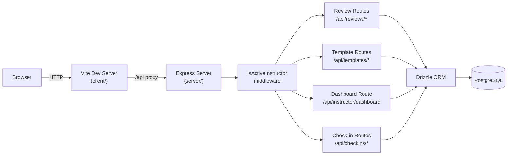

# Sprint 002 Technical Plan

## Architecture Version

- **From version**: architecture-001 (foundation: Drizzle schema, stub auth, routing shell)
- **To version**: architecture-002 (instructor review workflow, templates, TA check-in)

## Architecture Overview



All new routes are protected by the existing `isActiveInstructor` middleware.
No changes to the auth flow or session layer.

---

## Component Design

### Component: Schema Addition — `ta_checkins` table

**Use Cases**: SUC-005

Add to `server/src/db/schema.ts`:

```ts
export const taCheckins = pgTable('ta_checkins', {
  id: serial('id').primaryKey(),
  instructorId: integer('instructor_id').notNull().references(() => instructors.id),
  taUserId: integer('ta_user_id').notNull().references(() => users.id),
  weekOf: text('week_of').notNull(),         // ISO date of Monday, e.g. "2026-03-02"
  wasPresent: boolean('was_present').notNull(),
  submittedAt: timestamp('submitted_at').defaultNow().notNull(),
}, (t) => ({
  uniq: unique().on(t.instructorId, t.taUserId, t.weekOf),
}))
```

Run `npm run db:generate && npm run db:migrate` to create the migration.

---

### Component: Dashboard API (`server/src/routes/instructor.ts`)

**Use Cases**: SUC-001, SUC-006

| Method | Path | Description |
|--------|------|-------------|
| GET | `/api/instructor/dashboard` | Returns `{ month, totalStudents, pending, draft, sent }` |

Query parameters: `?month=YYYY-MM` (defaults to current month).

Counts are computed with Drizzle grouped queries on `monthly_reviews` filtered
by `instructorId` (from session) and `month`.

---

### Component: Review Routes (`server/src/routes/reviews.ts`)

**Use Cases**: SUC-002, SUC-003, SUC-006

| Method | Path | Description |
|--------|------|-------------|
| GET | `/api/reviews` | List reviews for instructor; `?month=YYYY-MM` filter |
| POST | `/api/reviews` | Create a new `pending` review for a student + month |
| GET | `/api/reviews/:id` | Get a single review |
| PUT | `/api/reviews/:id` | Update subject/body (only when `status != sent`) |
| POST | `/api/reviews/:id/send` | Advance status to `sent`, set `sentAt` |

Business rules enforced in route handlers (no separate service layer needed
at this scale):
- PUT returns 409 if `status === sent`
- POST `/send` is idempotent if already sent

Response shape:
```ts
interface ReviewDto {
  id: number
  studentId: number
  studentName: string
  month: string
  status: 'pending' | 'draft' | 'sent'
  subject: string | null
  body: string | null
  sentAt: string | null
  createdAt: string
  updatedAt: string
}
```

---

### Component: Template Routes (`server/src/routes/templates.ts`)

**Use Cases**: SUC-004

| Method | Path | Description |
|--------|------|-------------|
| GET | `/api/templates` | List templates for instructor |
| POST | `/api/templates` | Create template |
| PUT | `/api/templates/:id` | Update template |
| DELETE | `/api/templates/:id` | Delete template |

Templates are scoped to the authenticated instructor. `DELETE` returns 404
if the template doesn't belong to the requesting instructor.

Response shape:
```ts
interface TemplateDto {
  id: number
  name: string
  subject: string
  body: string
  createdAt: string
  updatedAt: string
}
```

---

### Component: Check-in Routes (`server/src/routes/checkins.ts`)

**Use Cases**: SUC-005

| Method | Path | Description |
|--------|------|-------------|
| GET | `/api/checkins/pending` | Returns TAs needing check-in for current week |
| POST | `/api/checkins` | Submit check-in records for the week |

`POST /api/checkins` body:
```ts
{ weekOf: string, entries: Array<{ taUserId: number, wasPresent: boolean }> }
```

Inserts are upserted (unique constraint on `instructorId + taUserId + weekOf`).
If no TAs are assigned, `GET /api/checkins/pending` returns `{ entries: [] }`.

---

### Component: Frontend Pages (`client/src/pages/`)

**Use Cases**: SUC-001 through SUC-006

New routes added to `App.tsx` (all under `ProtectedRoute role="instructor"`):

| Route | Component | Purpose |
|-------|-----------|---------|
| `/dashboard` | `DashboardPage` | Real dashboard replacing stub |
| `/reviews` | `ReviewListPage` | List all reviews for selected month |
| `/reviews/:id` | `ReviewEditorPage` | Draft/edit/send a single review |
| `/templates` | `TemplateListPage` | List and manage templates |
| `/templates/new` | `TemplateEditorPage` | Create template |
| `/templates/:id` | `TemplateEditorPage` | Edit template |
| `/checkin` | `CheckinPage` | Weekly TA attendance check-in |

**Shared component**: `MonthPicker` — a controlled `<select>` rendered as a
shadcn/ui Select showing the last 12 months; updates a `?month=` query
param via Wouter's `useSearch` / `useLocation`.

**Template variable substitution** (client-side, preview only):
```ts
function applyTemplate(template: TemplateDto, studentName: string, month: string): string {
  return template.body
    .replace(/\{\{studentName\}\}/g, studentName)
    .replace(/\{\{month\}\}/g, month)
}
```

---

### Component: Client Types (`client/src/types/`)

New files:
- `review.ts` — `ReviewDto`, `ReviewStatus`
- `template.ts` — `TemplateDto`
- `checkin.ts` — `CheckinEntry`, `PendingCheckinResponse`

---

## Decisions

1. **Review creation flow**: Auto-create `pending` review rows for all of
   the instructor's assigned students when they open the review list for a
   given month (if rows don't already exist). For Java/Python classes, the
   body will ultimately be auto-generated from the student's GitHub commits;
   this generation step requires the student's GitHub username (from Pike13,
   Sprint 005) and the GitHub MCP integration (Sprint 006). In Sprint 002,
   the auto-created review body is empty — the instructor fills it in
   manually. A "Generate from GitHub" placeholder button can be scaffolded
   in the editor UI but will only become functional in Sprint 006.

2. **Check-in trigger**: A dismissible banner on the instructor dashboard
   appears whenever the current week's TA check-in has not yet been
   submitted. The banner lists TAs from `instructor_students` (empty until
   Sprint 005). If a TA is present in class but has no profile in the
   system, the instructor can click "Notify Admin" to send an in-app
   message to admin requesting profile creation (stored as an
   `admin_notifications` record — see schema addition below).

## Additional Schema Addition: `admin_notifications`

To support the "Notify Admin" flow from the check-in banner:

```ts
export const adminNotifications = pgTable('admin_notifications', {
  id: serial('id').primaryKey(),
  fromUserId: integer('from_user_id').notNull().references(() => users.id),
  message: text('message').notNull(),
  isRead: boolean('is_read').notNull().default(false),
  createdAt: timestamp('created_at').notNull().defaultNow(),
})
```

Admin reads these in the Sprint 003 admin panel. In Sprint 002, the
instructor only needs the ability to send them.
